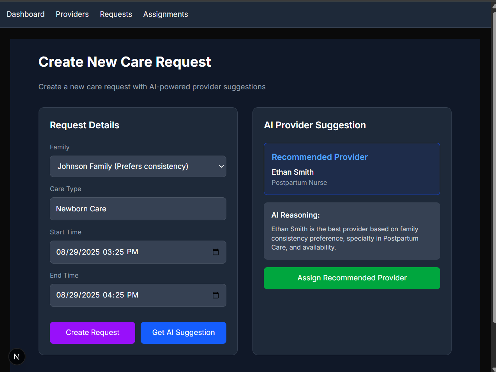
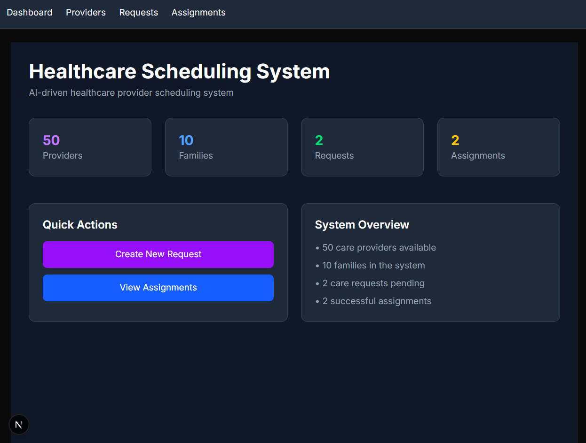
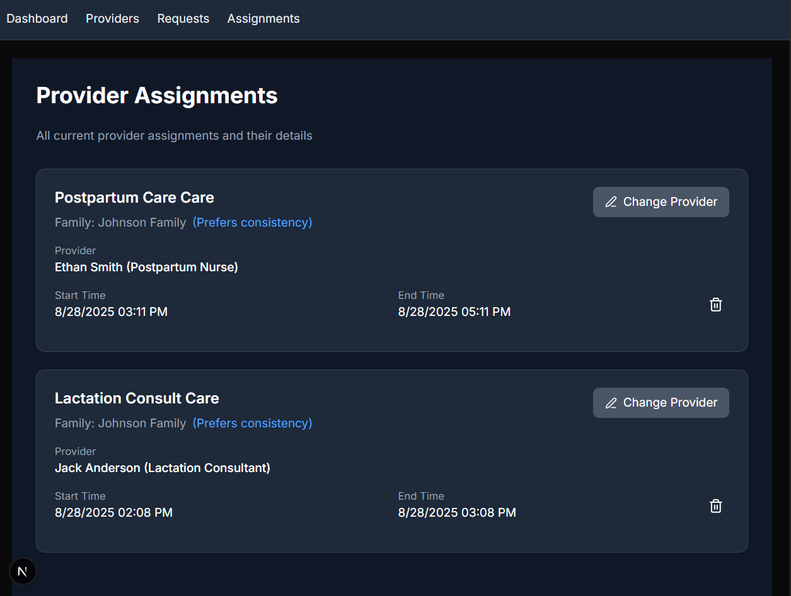
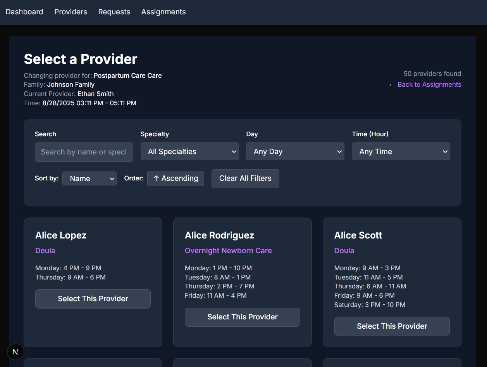

# Healthcare Scheduling System

AI-assisted scheduling demo for providers and families.

Tech: Next.js 15 (App Router), Express + Prisma, PostgreSQL, OpenAI, Docker

---

## Quick Start

Docker (recommended)
```bash
docker compose up -d
```

Local
```bash
# Backend
cd backend && npm install
npx prisma migrate dev --name init
npm run prisma:seed
npm run dev

# Frontend
cd ../frontend && npm install
npm run dev
```

Access
- Frontend: http://localhost:3000
- API: http://localhost:4000

---

## Key Features
- Providers page: pagination, independent day/time/specialty filters, search (debounced), sorting, AM/PM display, URL sync
- Assign/Change provider from Requests/Assignments via the Providers page (keeps filter/search context)
- Requests and Assignments CRUD with conflict detection
- AI provider recommendation with reasoning

---

## Documentation
- docs/GettingStarted.md
- docs/Features.md
- docs/API.md
- docs/Architecture.md
- docs/Troubleshooting.md

---

## UI Screenshots

> Place PNGs in `frontend/public/screenshots/` with the names below to render them on GitHub.






---

## Author
Richard Hall
